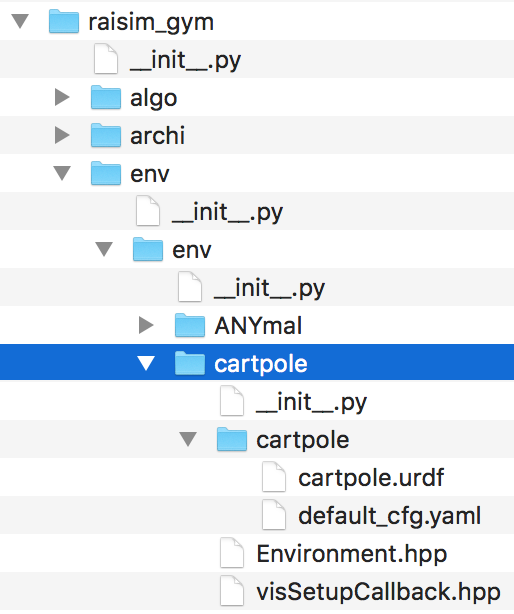
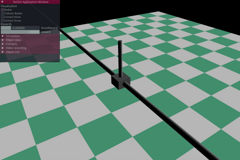
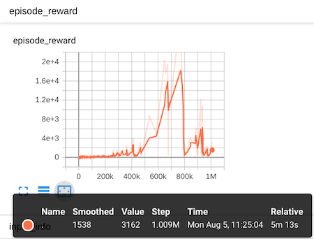

# 1D Cart pole RaisimGym tutorial

In this page, we present a simple toy example; 1D cart pole problem for better understanding and easy-of-use [RaisimGym](https://github.com/leggedrobotics/raisimGym). To do this tutorial, we assume that you already set up raisimGym as presented in [README](https://github.com/leggedrobotics/raisimGym) and are able to run one of the examples. 

It is also worth mentioning that [RaiSim Manual](https://slides.com/jeminhwangbo/raisim-manual) introduces fundamental ideas of Raisim, useful theoretical background and examples so that it is strongly recommended to have a look alongside with this page.

This tutorial introduces the following and if you are already familiar with any, feel free to skip.

- [1. adding a new Raisim environment](#1-adding-a-new-raisim-environment)
  * [1.1 specifying resource path](#11-specifying-resource-path)
  * [1.2 registering the new environment](#12-registering-the-new-environment)
  * [1.3 create Environment.hpp and copy visSetupCallback.hpp](#13-create-environmenthpp-and-copy-vissetupcallbackhpp)
- [2. creating cart pole URDF model and configuration file](#2-creating-cart-pole-urdf-model-and-configuration-file)
  * [2.1 1D Cart pole](#21-1d-cart-pole)
  * [2.2 Configuration file](#22-configuration-file)
- [3. Raisim Environment.hpp](#3-raisim-environmenthpp)
- [4. create python script and compile the environment](#4-create-python-script-and-compile-the-environment)
- [5. training using Raisim](#5-training-using-raisim)
- [6. testing the trained model](#6-testing-the-trained-model)


### 1. adding a new Raisim environment
#### 1.1 specifying resource path
go to `raisim_gym/env/env` and create a folder named `cartpole` and create `__init__.py` in the same path with the following content.
```python
import os
from _raisim_gym import *

__CARTPOLE_RESOURCE_DIRECTORY__ = os.path.dirname(os.path.realpath(__file__))+'/cartpole'
```
This specifies our new environment's resource directory that will be used by other modules later on.
#### 1.2 registering the new environment
open `raisim_gym/setup.py` using your favorite editor, and add the following lines (around 28-30):
```python
elif environment == 'cartpole':
        __ENVIRONMENT_PATH__ = os.path.dirname(os.path.realpath(__file__)) + "/raisim_gym/env/env/cartpole"
```
#### 1.3 create Environment.hpp and copy visSetupCallback.hpp
create a file named Environment.hpp in `raisim_gym/env/env/cartpole` and copy [visSetupCallback.hpp](../../blob/master/raisim_gym/env/env/laikago/visSetupCallback.hpp) file from another example (e.g., laikago) to the same folder (`raisim_gym/env/env/cartpole`). `Environment.hpp` file is now empty but we will fill it in [3. Raisim Environment.hpp](#3-raisim-environmenthpp)

### 2. creating cart pole URDF model and configuration file
go to `raisim_gym/env/env/cartpole` and create another folder named `cartpole` (confusion alert! we now have two cartpole folders). And create `cartpole.urdf` and `default_cfg.yaml` files under the folder we just created. So far your folder structure should look like

<p align="center">

</p>

#### 2.1 1D Cart pole
We will create 4 links; `world`, `sliderBar`, `slider`, and `rod` with 3 joints; `world_to_sliderBar`, `sliderBar_to_slider`, and `slider_to_rod`. The figure below illustrates details and you can easily find the corresponding entities.
<p align="center">
 
</p>
Let's add 4 links in the cartpole.urdf file as follow;

```XML
<?xml version="1.0"?>
<robot name="Cartpole">
<link name="world">  </link>
  <link name="sliderBar">
    <visual>
      <geometry>
        <cylinder radius="0.05" length="40"/>
      </geometry>
      <origin xyz="0 0 0" rpy="0 1.5708 0"/>
    </visual>
    <inertial>
      <mass value="0"/>
      <inertia ixx="1.0" ixy="0.0" ixz="0.0" iyy="1.0" iyz="0.0" izz="1.0"/>
    </inertial>
  </link>

  <link name="slider">
    <inertial>
      <mass value="2"/>
      <inertia ixx="2.0" ixy="0.0" ixz="0.0" iyy="1.0" iyz="0.0" izz="2.0"/>
    </inertial>
    <visual>
      <geometry>
        <box size="0.3 0.3 0.2"/>
      </geometry>
      <origin xyz="0 0 0"/>
    </visual>
  </link>

  <link name="rod">
    <inertial>
      <origin xyz="0 0 0.5"/>
      <mass value="5"/>
      <inertia ixx="1.0" ixy="0.0" ixz="0.0" iyy="1.0" iyz="0.0" izz="1.0"/>
    </inertial>
    <visual>
      <geometry>
        <cylinder radius="0.04" length="0.8"/>
      </geometry>
      <origin rpy="0 0 0" xyz="0 0 0.5"/>
    </visual>
  </link>
```
This is a very simple URDF model and you can also find more complex example from [ROS URDF tutorial page](http://wiki.ros.org/urdf/Tutorials/Building%20a%20Visual%20Robot%20Model%20with%20URDF%20from%20Scratch). Note that it is important to **create the `world` link** with fixed joint for Raisim.

and append 3 joints as fixed, prismatic, and revolute type

```XML
<joint name="world_to_sliderBar" type="fixed">
    <axis xyz="0 0 0"/>
    <origin xyz="0.0 0.0 5.0"/>
    <parent link="world"/>
    <child link="sliderBar"/>
</joint>

<joint name="slider_bar_to_slider" type="prismatic">
    <axis xyz="1 0 0"/>
    <origin xyz="0.0 0.0 0.0"/>
    <parent link="sliderBar"/>
    <child link="slider"/>
    <limit effort="1000.0" lower="-15" upper="15" velocity="5"/>
</joint>

<joint name="slider_to_rod" type="revolute">
    <axis xyz="0 1 0"/>
    <parent link="slider"/>
    <child link="rod"/>
    <origin xyz="0.0 0.0 0"/>
    <limit effort="80" lower="-6.28" upper="6.28" velocity="15"/>
    <dynamics damping="0.0" friction="0.0"/>
</joint>
</robot>
```
We move `sliderBar` 5m above the floor for better visualization and define the prismatic joint between `sliderBar` and `slider` in order to only allow x-axis movement (the blue axis in the `world` link). Finally, the revolute joint defines the rod and the slider relationship; rotating along y-axis (the red axis) with the origin of the rod (i.e., x=0, y=0, z=0). For simplity and easy of training, collisions are not considered in this example. Up-right position of the rod defines zero degree.

#### 2.2 Configuration file
open `default_cfg.yaml` file and fill in with the following code. These are some control flags and hyperparameters for PPO2 training. We will re-visit this in [training section](#5-training-using-raisim).

```XML
seed: 1
record_video: yes

environment:
  num_envs: 100
  num_threads: 40
  simulation_dt: 0.0025
  control_dt: 0.01
  max_time: 4.0
  learning_rate: 1e-3
  nminibatches: 10
  noptepochs: 10
  total_timesteps: 10000000
  eval_every_n: 50

  forceRewardCoeff: -5e-7
```

### 3. Raisim Environment.hpp
Every Raisim environment should have Environment.hpp that describes `step`, `reset`, `reward`, and creates an environment. Below shows the environment for our cart pole example and we will only highlight important parts.

First, let's include necessary files.
```c++
#include <stdlib.h>
#include <cstdint>
#include <set>
#include <raisim/OgreVis.hpp>
#include "RaisimGymEnv.hpp"
#include "visSetupCallback.hpp"

#include "visualizer/raisimKeyboardCallback.hpp"
#include "visualizer/helper.hpp"
#include "visualizer/guiState.hpp"
#include "visualizer/raisimBasicImguiPanel.hpp"

using namespace std;
#define deg2rad(ang) ((ang) * M_PI / 180.0)
#define rad2deg(ang) ((ang) * 180.0 / M_PI)
```

In the constructor, we need to do several things; load the URDF file, configure the environment including action and observation define, and their scaling. In this example, we have only **`one action`** and **`four observations`**. The action is the pushing-force that we apply to the slider along x-axis and four observations are cart position (x), tilted angle of the rod (theta), cart linear velocity (x_dot), and angular velocity of the rod (theta_dot).

```c++
namespace raisim {

class ENVIRONMENT : public RaisimGymEnv {

 public:

  explicit ENVIRONMENT(const std::string& resourceDir, const YAML::Node& cfg, bool visualizable) :
      RaisimGymEnv(resourceDir, cfg), distribution_(0.0, 0.2), visualizable_(visualizable) {

    /// add objects
    cout<<resourceDir<<endl;
    cartpole_ = world_->addArticulatedSystem(resourceDir+"/cartpole.urdf");
    cartpole_->setControlMode(raisim::ControlMode::FORCE_AND_TORQUE);
    auto ground = world_->addGround();
    world_->setERP(0,0);
    /// get robot data
    gcDim_ = cartpole_->getGeneralizedCoordinateDim(); //will be two; cart position and pole angle
    gvDim_ = cartpole_->getDOF(); // will be two; cart linear velocity and pole angular velocity.
    nJoints_ = 2;
    /// initialize containers
    gc_.setZero(gcDim_); gc_init_.setZero(gcDim_);
    gv_.setZero(gvDim_); gv_init_.setZero(gvDim_);
    cartpole_->setGeneralizedForce(Eigen::VectorXd::Zero(nJoints_));

    /// MUST BE DONE FOR ALL ENVIRONMENTS
    obDim_ = 4; /// x,theta, x_dot, theta_dot
    actionDim_ = 1;
    actionMean_.setZero(actionDim_); actionStd_.setZero(actionDim_);
    obMean_.setZero(obDim_); obStd_.setZero(obDim_);
```
`gc_` and `gv_` denote the generalized coordinate and velocity of our cart pole system (more detail theoritical explanation can be found from [Raisim Manual](https://slides.com/jeminhwangbo/raisim-manual#/5/6)), so that the dimensions of `gc_` (i.e., `gcDim_` is 2 which correspondence slider position and rod angle) and `gvDim_` is 2 as well which are slider's linear velocity and rod angular velocity.

We set `nJoints_` as 2 since there are two joints; prismatic and revolute. Finally, we define the dimensions of our observations (4) and action (1). 

Next, we set a visualization routine, action scale, and load Reward coefficients. Rewards can be logged with `gui::rewardLogger` alongside with tensorboard, or console print messages. You can find the rewards from [Raisim Application Window](#21-1d-cart-pole).

```c++
    /// action & observation scaling
    actionMean_ = gc_init_.tail(actionDim_);
    actionStd_.setConstant(0.6);

    obMean_.setZero();
    obStd_ << 3, //cart position (meter)
              2*M_PI, //pole angle (rad)
              0.1, //cart velocity (m/s)
              10; //pole angular velocity (rad/sec)
    
    //Reward coefficients
    forceRewardCoeff_ = cfg["forceRewardCoeff"].as<double>();
    gui::rewardLogger.init({"reward", "forceReward"});
    reward_=0;

    /// visualize if it is the first environment
    if (visualizable_) {
      auto vis = raisim::OgreVis::get();

      /// these method must be called before initApp
      vis->setWorld(world_.get());
      vis->setWindowSize(1800, 1200);
      vis->setImguiSetupCallback(imguiSetupCallback);
      vis->setImguiRenderCallback(imguiRenderCallBack);
      vis->setKeyboardCallback(raisimKeyboardCallback);
      vis->setSetUpCallback(setupCallback);
      vis->setAntiAliasing(2);

      /// starts visualizer thread
      vis->initApp();
      cartpoleVisual_ = vis->createGraphicalObject(cartpole_, "Cartpole");
      vis->createGraphicalObject(ground, 20, "floor", "checkerboard_green");
      desired_fps_ = 50.;
      vis->setDesiredFPS(desired_fps_);
      vis->select(cartpoleVisual_->at(0), false);
      vis->getCameraMan()->setYawPitchDist(Ogre::Radian(-1.0), Ogre::Radian(-1.0), 3);
    }
  }
```

`reset` function is called whenever an episode terminated either end up with terminal conditions or reach to the maximum episode length. For simplity, we just set the slider's state with `gc_init_` and `gv_init_` which are all zeros. but you can provide better variations that may be able to learn a more robust and efficient model.

```c++
  ~ENVIRONMENT() final = default;

  void init() final { }

  void reset() final {
    cartpole_->setState(gc_init_, gv_init_);
    updateObservation();
    if(visualizable_)
      gui::rewardLogger.clean();
  }
```
The `step` function gets called everystep and performs set action, one step integration, and reward computation. From the below note that we define 2 dims vector for generalized force (gf) and set only the first element which corresponds to the pushing force and leaves the second as zero (if we set it non-zero value, this implies we apply some torque to the revolute joint that we don't want in this example).

For the reward calculation, we use the same reward formulation as of openai gym's cart pole [example](https://github.com/openai/gym/blob/5e6f11d07781404459672e114cb86cb6a1a015c6/gym/envs/classic_control/cartpole.py#L119) (which set reward=1 if an episode survived) and add the squared sum of action to prevent some exaggerated action command.

```c++
  float step(const Eigen::Ref<EigenVec>& action) final {
    /// action scaling
    actionScaled_ = action.cast<double>()*1000;
    Eigen::Vector2d gf; gf.setZero();
    gf.head(1) = actionScaled_; //set only the first element with action (i.e., cart pushing force)
    cartpole_->setGeneralizedForce(gf);

    auto loopCount = int(control_dt_ / simulation_dt_ + 1e-10);
    auto visDecimation = int(1. / (desired_fps_ * simulation_dt_) + 1e-10);

    for(int i=0; i<loopCount; i++) {
      world_->integrate();

      if (visualizable_ && visualizeThisStep_ && visualizationCounter_ % visDecimation == 0)
        raisim::OgreVis::get()->renderOneFrame();

      visualizationCounter_++;
    }
    updateObservation();
    forceReward_ = forceRewardCoeff_ * cartpole_->getGeneralizedForce().squaredNorm();

    reward_=1.0;
    if(visualizeThisStep_) {
        gui::rewardLogger.log("forceReward", forceReward_);
        gui::rewardLogger.log("reward", reward_);
    }
   return forceReward_ + reward_;
  }

  void updateExtraInfo() final {
    extraInfo_["reward"] = reward_;
  }
```

In the observation update, we set `obDouble_` with the generalized coordinate, `gc_`, and velocity `gv_` and scaled them predefined mean and standard deviation. The order of observation is matter, it is recommended to keep eyes on the order.

```c++
  void updateObservation() {
    cartpole_->getState(gc_, gv_);
    obDouble_.setZero(obDim_); obScaled_.setZero(obDim_);
    obDouble_ << gc_,gv_; //x, theta, x_dot, theta_dot
    obScaled_ = (obDouble_-obMean_).cwiseQuotient(obStd_);
  }

  void observe(Eigen::Ref<EigenVec> ob) final {
    /// convert it to float
    ob = obScaled_.cast<float>();
  }
```
We terminate a episode when the rod inclined more than +-50 degs or the slider positioned out of +-2m.
 
```c++
  bool isTerminalState(float& terminalReward) final {
    terminalReward = float(terminalRewardCoeff_);
    //If the angle of pole is greater than +-50 degs or the cart position is greater than +-2m,
    //treat them as terminal conditions
    if(rad2deg(abs(obDouble_[1]))> 50. || abs(obDouble_[0])>2.0) return true;
    terminalReward = 0.f;
    return false;
  }

  void setSeed(int seed) final {
    std::srand(seed);
  }

  void close() final {
  }

 private:
  int gcDim_, gvDim_, nJoints_;
  double reward_;
  bool visualizable_ = false;
  std::normal_distribution<double> distribution_;
  raisim::ArticulatedSystem* cartpole_;
  std::vector<GraphicObject> * cartpoleVisual_;
  Eigen::VectorXd gc_init_, gv_init_, gc_, gv_, actionScaled_,torque_;
  double terminalRewardCoeff_ = -10.;
  double forceRewardCoeff_ = 0., forceReward_ = 0.;
  double desired_fps_ = 60.;
  int visualizationCounter_=0;
  Eigen::VectorXd actionMean_, actionStd_, obMean_, obStd_;
  Eigen::VectorXd obDouble_, obScaled_;
};

}
```
The complete example files can be found from [here](https://github.com/inkyusa/raisimGym/tree/master/raisim_gym/env/env/cartpole).

### 4. create python script and compile the environment
We need a python script to train/test the environment we just created. To do this, go to the `raisimGym/scripts` and create `cartpole_tutorial.py` file.
The contents will be similar as of [laikago example](../../blob/master/scripts/laikago_blind_locomotion.py) but we will add `test mode` that will allow to immediately test a pretrained model.

#cartpole_tutorial.py
```python
from ruamel.yaml import YAML, dump, RoundTripDumper
from raisim_gym.env.RaisimGymVecEnv import RaisimGymVecEnv as Environment
from raisim_gym.env.env.cartpole import __CARTPOLE_RESOURCE_DIRECTORY__ as __RSCDIR__
from raisim_gym.algo.ppo2 import PPO2
from raisim_gym.archi.policies import MlpPolicy
from raisim_gym.helper.raisim_gym_helper import ConfigurationSaver, TensorboardLauncher
from _raisim_gym import RaisimGymEnv
import os
import math
import argparse

# configuration
parser = argparse.ArgumentParser()
parser.add_argument('--cfg', type=str, default=os.path.abspath(__RSCDIR__ + "/default_cfg.yaml"),
                    help='configuration file')
parser.add_argument('-m', '--mode', required=True, help='set mode either train or test', type=str, default='train')
parser.add_argument('-w', '--weight', help='trained weight path', type=str, default='')
args = parser.parse_args()
mode = args.mode
cfg_abs_path = parser.parse_args().cfg
cfg = YAML().load(open(cfg_abs_path, 'r'))

# save the configuration and other files
rsg_root = os.path.dirname(os.path.abspath(__file__)) + '/../'
log_dir = rsg_root + '/data'
saver = ConfigurationSaver(log_dir=log_dir + '/Cartpole_tutorial',
                           save_items=[rsg_root + 'raisim_gym/env/env/cartpole/Environment.hpp', cfg_abs_path])

# create environment from the configuration file
if args.mode == "test": # for test mode, force # of env to 1
    cfg['environment']['num_envs'] = 1
env = Environment(RaisimGymEnv(__RSCDIR__, dump(cfg['environment'], Dumper=RoundTripDumper)))


if mode == 'train':
    # tensorboard, this will open your default browser.
    TensorboardLauncher(saver.data_dir + '/PPO2_1')
    # Get algorithm
    model = PPO2(
        tensorboard_log=saver.data_dir,
        policy=MlpPolicy,
        policy_kwargs=dict(net_arch=[dict(pi=[128, 128], vf=[128, 128])]),
        env=env,
        gamma=0.998,
        n_steps=math.floor(cfg['environment']['max_time'] / cfg['environment']['control_dt']),
        ent_coef=0,
        learning_rate=cfg['environment']['learning_rate'],
        vf_coef=0.5,
        max_grad_norm=0.5,
        lam=0.95,
        nminibatches=cfg['environment']['nminibatches'],
        noptepochs=cfg['environment']['noptepochs'],
        cliprange=0.2,
        verbose=1,
    )
    # PPO run
    model.learn(
        total_timesteps=cfg['environment']['total_timesteps'],
        eval_every_n=cfg['environment']['eval_every_n'],
        log_dir=saver.data_dir,
        record_video=cfg['record_video']
    )
    model.save(saver.data_dir)
    # Need this line if you want to keep tensorflow alive after training
    input("Press Enter to exit... Tensorboard will be closed after exit\n")
# Testing mode with a trained weight
else:
    weight_path = args.weight
    if weight_path == "":
        print("Can't find trained weight, please provide a trained weight with --weight switch\n")
    else:
        print("Loaded weight from {}\n".format(weight_path))
        model = PPO2.load(weight_path)
    obs = env.reset()
    running_reward = 0.0
    ep_len = 0
    for _ in range(100000):
        action, _ = model.predict(obs)
        obs, reward, done, infos = env.step(action, visualize=True)
        running_reward += reward[0]
        ep_len += 1
        if done:
            print("Episode Reward: {:.2f}".format(running_reward))
            print("Episode Length", ep_len)
            running_reward = 0.0
            ep_len = 0
```
As mentioned earlier, there are hyperparameters of algorithm we are using (i.e., PPO2) and (such params; `cfg['environment']['nminibatches']`, and `cfg['environment']['total_timesteps']`, etc.). These values are defined in [configuration file](#22-configuration-file) and you can alter them while training.

Let's compile the example and move to the next section. Go to the root folder (i.e., `raisimGym`) and execute the following command line.
```
python3 setup.py install --CMAKE_PREFIX_PATH $LOCAL_BUILD --env cartpole
```

### 5. training using Raisim
Training procedure is the same as other examples and go to the root folder (`raisimGym`) and execute the following command. 
```shell
python3 scripts/cartpole --mode train cartpole_tutorial.py
```
By default, we visualize the trained model every 50 policy updates and will be able to animations as shown below

0 policy update | 50 policy update  
:-----------------------------------:|:------------------------------------:
 | 

100 policy update   | 200 policy update  
:-----------------------------------:|:------------------------------------:
 | 

By default, we also enabled tensorboard logger. Once you run the above command, your default browser will be opened and you can monitor the training progress (maybe select `SCALAR` from the top right-most drop-down menu to see episode_reward and episode_length).

The figure below exemplifies one of the training sessions which took 5 mins for 1M timesteps (200 policy update).
<p align="center">

</p>

### 6. testing the trained model
Once you finished training, we can deploy it by simply switching the mode. The command below will load a pretrained weight and perform a test for 100,000 timesteps.
```shell
python3 scripts/cartpole --mode test --weight ./weights/cartpole_tutorial/cartpole.pkl cartpole_tutorial.py
```
You should be able to see the trained model in action.


